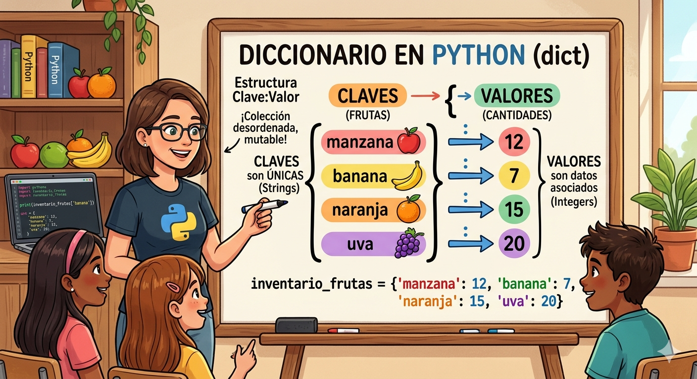

# DICCIONARIOS EN PYTHON
Conceptos y ejercicios de diccionarios en python

- Los diccionarios son datos estructurados, es decir, hacen referencia a una colección de datos.
- Son una coleccion desordenada de pares de datos de la forma **clave:valor**, conocidos como elementos o items.
- Son mutables, una vez definido se le pueden aggregar nuevos elementos modificar o eliminaar algunos de los que ya tiene.
- Tambien son conocidos como arreglos asociativos.

## Representación gráfica de un diccionario



## Sintaxis

`nombre_diccionario = {clave1:valor1, clave2,:valor2,...}`

- Cada item o item tiene la forma **clave:valor**
- En cada item hay una clave y uno o más valores. Si se desconoce el valor, se puede completar con *None*
- Los elementos del diccionario se indexan por la clave.
- Las claves solo pueden ser datos inmutables
- LOs valores solo pueden ser datos mutables e inmutables
- Las claves no pueden repetirse dentro de un diccionario

### Ejemplo

`frutas = {'manzana':34, 'pera':45}`

## Operaciones

### Agregar elmentos

`nombre_diccionario[clave] = valor`

`frutas['cereza'] = 90`

### Consultar o modificar elementos

`print('El valor de pera es:', frutas['pera'])`

## Eliminar elementos

`del frutas['pera']`

### Operador de pertenencia

```py
if 'cereza' in frutas:
     print('Si esta creza en el diccionario')
else:
    print('No esta cereza en el diccionario')
```
## Ejercicio
Cree un programa en python que utlize un diccionario para guardar los nombres de sus amigos y su telefono. En este caso, el diccionario representa una genda telefonica el program te dira nombres y telefonos y los ira guardando en el diccionario ( los nombre en mayuscula). Además, el programa debe permitir consultar o eliminar un telefono incluya un menú de opciones